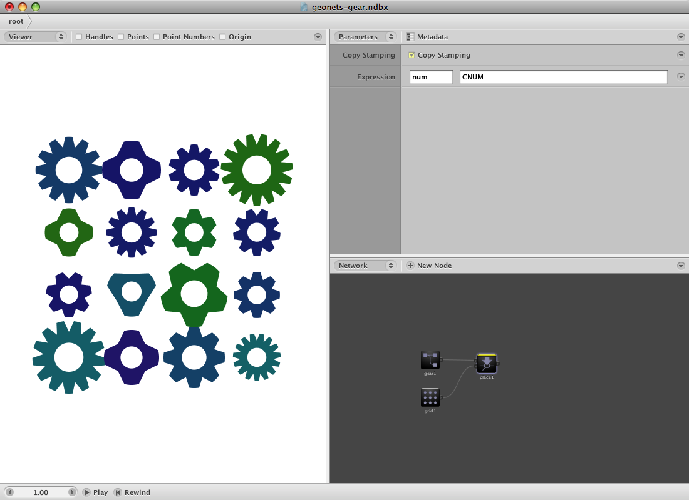

A **geonet** is a network in a network. Other modular software programs sometimes refer to it as subnetworks or subpatches. Geonet derives from geometry network and is in fact **pretty much the same as a normal network** in NodeBox. 

The idea is that you **create a new network, *and thus a new geometry*, inside a node**. You can start a geonet by creating a [Geonet](../nodes/geonet.html) node. The principle of geonets allows you to **have a cleaner network** and is in fact an **easy way to create new nodes** without any code juggling.

Creating Geonets
----------------

Let's try making a gear node. 

Create a [Geonet](../nodes/geonet.html) node. Give the node a new name by clicking the default name. A textwindow will appear. Enter **gear**.

Click on the geonet and press the ENTER key. You should see the address bar above the viewer pane change into this:

All other panes should be empty, in fact everything looks as if you would start a new file. 

* Create an **Ellipse** node. Leave it at it's default.
* Create a **Star** node. Change **Points** to **6**, **Outer Diameter** to **150.00* and **Inner Diameter** to **70.00*.
* Create a **Compound** node. Change **Function** to **intersect**.
* Connect ellipse1 to **shape** port of compound1.
* Connect star1 to **shapeB** port of compound1.

* Create an **Ellipse** node. Change **Width** to **40.00** and **Height** to **40.00**.
* Create a **Compound node** and change **Function** to **Difference**.
* Connect compound1 to **shape** port of compound2.
* Connect ellipse2 to **shapeB** port of compound2.

Rendering the compound2 node should end up with this:

Go back to the root network by pressing the **root** tab in the address bar.

Parent - Child Relation.
------------------------

In order to avoid going in and outside the network for every alteration we can create parameters for the node and refer to it in the geonet over a parent-child relation. Let's implement 2 parameters:

* a points parameter which will change the amount of teeth in the gear.
* a color parameter to give it color.

Click on the gear node and press the **[Metadata](metadata.html)** button in the Parameters pane. A new window will appear which allows you to **create a new parameter**. Press the **little "+" button** on the lower left corner of the metadata window. Select **Parameter** and **name it points**. You can change some settings on the right side of the metadata window. **Set Type to Int**. Close the window. You should see a parameter called points with a numeric widget in the parameter pane.

Do the same procedure once more. Create a parameter called **fill** and **set it's Type to Color**. Let's implement these new variables in the geonetwork.

* Click on the gear node and open it by pressing the ENTER key.
* Click on **star1** and set **Points** to the expression: <pre>parent.points</pre> Press Enter. This new expression calls for the number of points in the parameter we've created before.
* Click on **compound2** and set **Fill** to the expression: <pre>parent.fill</pre> Press Enter and leave this node as the rendered node.
* Return to the root network.

**Try out** 

* Create a few variations on the gear node. Copy paste the whole node and change some settings.
* Implement a variable for dimensions of the gear.
* Read the [copy stamping](copy-stamping.html) page and try to implement it on this gear example. Create a grid of 4 * 4 gears with difference in size, color and teeth.

House Geonet
------------

The next example builds a house in a geonet and will create a parameter for the dimension of the house.

We start with a basic house: walls and a roof. We take away part of the walls as a door.

* Create a **Rect** node and leave it at it's default.
* Create a **Polygon** node. Change **Y** to **-60.00**, **Radius** to **80.00** and toggle on the **Align** button.
* Create a **Compound** node. Leave it at default. Connect **rect1** to **shape** port and **polygon1** to **shapeB**.
* Create a **Rect** node. Change **X** to **15.00**, **Y** to **30.00**, **Width** to **30.00** and **Height** to **65.00**
* Create a **Compound** node. Change **Function** to **difference** and give it a **Strokewidth** of **1.00**. Connect **compound1** to **shape** port and **rect2** to **shapeB** port.
* Create a **Fit** node and connect **compound2** to it. **Keep fit1 the rendered node** and **go back to the root network**.

Now **add a parameter called size** by clicking the metadata button. Set **Type** to **Float**.
You should see it appear in the parameter pane. Drag the widget to **40.00** and ENTER the geonet again.

In **fit1** node set **Width** to the expression: <pre>parent.size</pre> **Enter and go back to the root network**.

**Try out** 

* Create a small landscape as shown in the picture above. Use a **Freehand** node for the landscape and a **Shape on Path** node to distribute the houses on the template from freehand.
* Read the [copy stamping](copy-stamping.html) page and try to implement different sizes for all houses.

