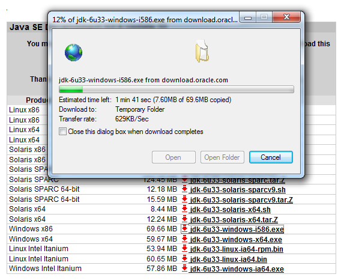
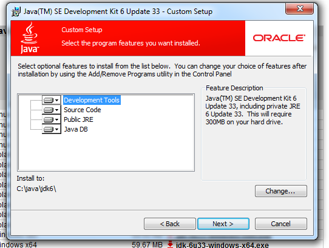
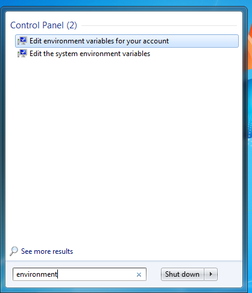
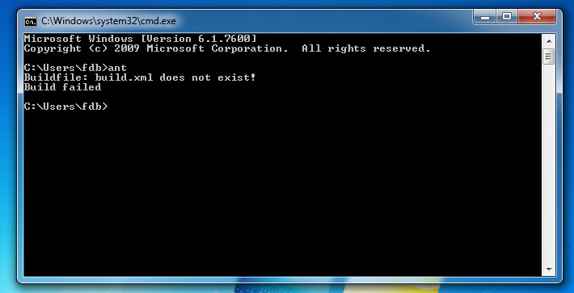
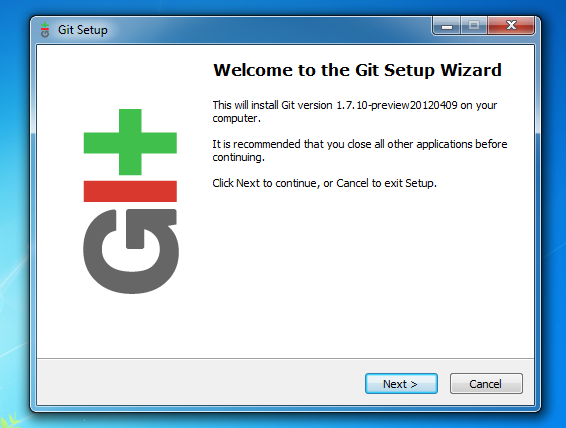
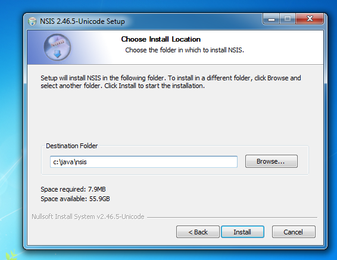
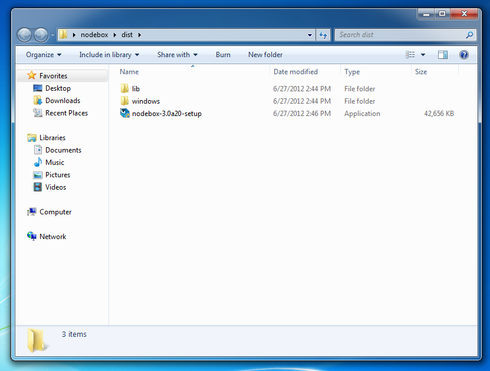

This tutorial shows how to install the necessary tools to start hacking on NodeBox 3.
We're using a clean Windows 7 install, and will walk through installing the necessary tools to get started.

This tutorial doesn't show you how to setup an IDE, rather showing you the tools from scratch. You can pick any IDE you like to actually work on the source.

## Install the Java Development Kit

Download [Java 6 SE for Windows X86](http://www.oracle.com/technetwork/java/javase/downloads/jdk6-downloads-1637591.html). You need the Windows x86 (i586) version (not the 64-bit version).

Install the JDK to `C:\java\jdk6`.

Install the JRE to `C:\java\jre6`.

## Install Apache Ant

Download Ant from [ant.apache.org](http://ant.apache.org/bindownload.cgi). Unpack the ZIP file into `C:\java` and rename it to "ant". Your `C:\java` folder should now look like this:

## Setup environment variables

Ant uses environment variables to find your Java install.

* Click Start and type "environment". Click "Edit environment variables for your account"

* Click on "Environment Variables".

* Create the following User variables by clicking New...:

  * Variable name: **JAVA_HOME** 
    Variable value: **C:\java\jdk6**
  * Variable name: **ANT_HOME** 
    Variable value: **C:\java\ant**
  * Variable name: **PATH** 
    Variable value: **%ANT_HOME%\bin;%PATH%**

* Test the setup. Start a new command prompt by clicking Start and typing `cmd`.
* In the command prompt, type `ant`. It should give an error `Buildfile: build.xml does not exist!` Then you know Ant is installed correctly. (If it mentions a missing tools.jar, double-check your setup).

## Install Git

Download [Git for Windows](http://git-scm.com/download/win) and run the installer. Accept all the defaults.

Double-click the "Git Bash" icon on the Desktop. Decide where you want to store the NodeBox project. In our case, we're going to put it on the desktop, so type:
    
    cd Desktop

Then, to clone the repository from GitHub, type:

    git clone git://github.com/nodebox/nodebox

## Run NodeBox

From a new Git Bash shell:

    cd Desktop/nodebox
    ant run

## Create a distributable .EXE file

We use NSIS and Ant to build executable files.

* Download [NSIS Unicode](http://code.google.com/p/unsis/downloads/list).
* Run the installer. The install location should be `C:\java\nsis`. This path is set in our build.properties.

Change the version number in `nodebox\version.properties`. Then, from a new Git Bash shell:

    cd Desktop/nodebox
    ant dist-win

The binary will be in the nodebox\dist folder, under the name `NodeBoxSetup.exe`.

