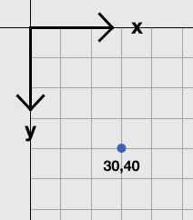
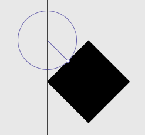

NodeBox works in 2 dimensions. The x dimension goes from left to right. The y dimension goes from top to bottom. The y axis is thus pointed down.

A point in NodeBox space is represented as x, y. For example, the point 30,40 would be located 30 points from the left and 40 points from the top of the origin.

The **origin** is the center of the canvas, point 0,0. All objects in NodeBox are centered around the origin. You can show the origin in the viewer pane by checking the "Origin" box at the top.

When you create a new shape in NodeBox, it will be centered on the origin. As an example, let's create a rectangle. In the viewer, turn the origin on. Note that if we drag the width or height, the object stays centered:

The origin is an important concept because it underlies the functionality of many nodes.

Transformation Nodes
--------------------
Node that transform a shape, such as the [rotate node](/node/reference/corevector/rotate.html), use the *origin* as their center point by default:

* Create a new document and turn the **origin** on in the viewer.
* Create a **rect** node. Set its **x** to **100.00**.
* Create a **rotate** node.
* Connect **rect1** to **rotate1**.
* In **rotate1**, drag the **angle** to **45.00**.

Note that the rectangle doesn't rotate around its center – it rotates around the origin:

The same happens in the scale node, although the effect there is much less notable.

Controlling the origin
----------------------
Try to be aware where your objects are in relation to the origin. This makes manipulations further in the network easier.

* Turn the origin on in the viewer to see where your objects are.
* Use an [align node](/node/reference/corevector/align.html) to move objects back to the origin after they've "wandered off".
* Use a [fit node](/node/reference/corevector/fit.html) to force objects back on the origin and fit them in a specified box as well.
