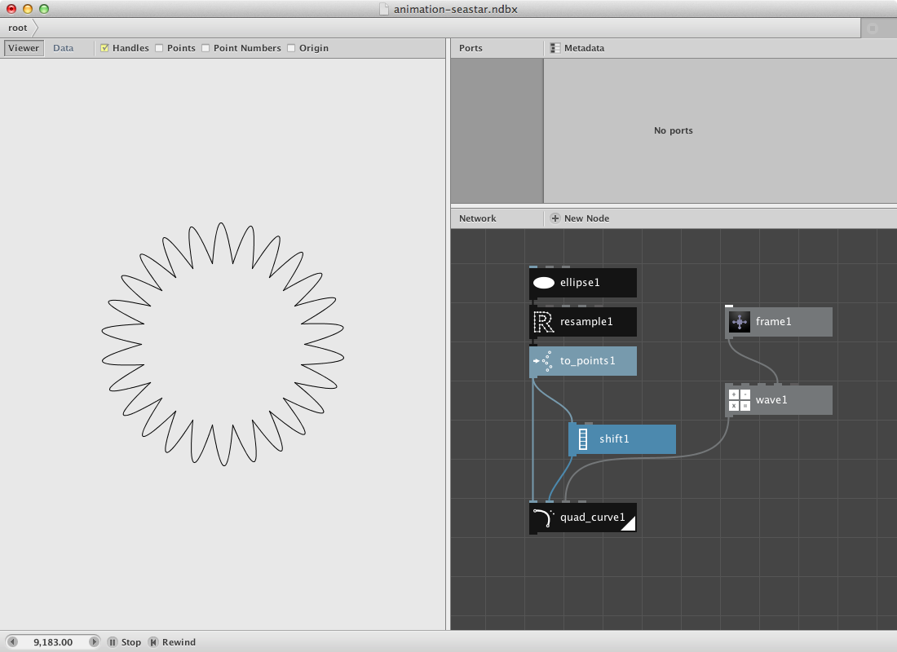
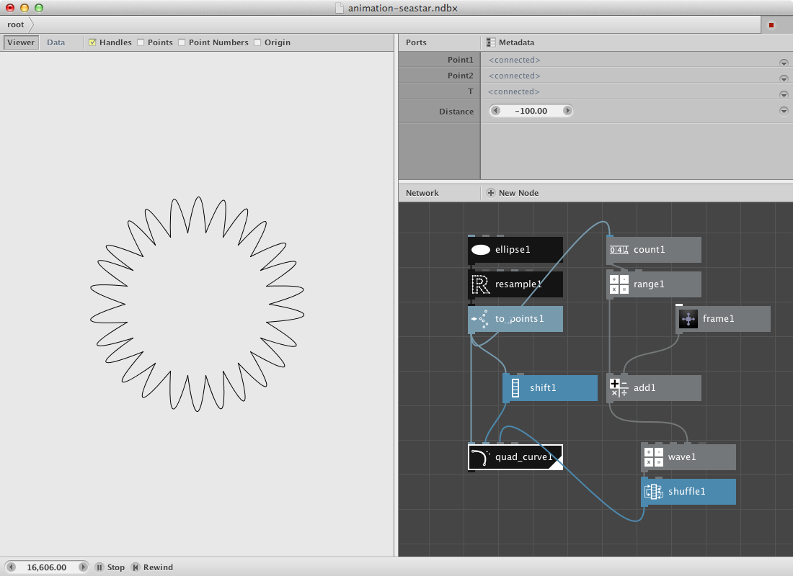

Frame
-------

Let's create a [moire effect](http://en.wikipedia.org/wiki/Moire_pattern) and automate it by using a first simple animation procedure based on the framenumber.

Create an [ellipse node](/node/reference/corevector/ellipse.html).

* Set **Width** to **5.0**.
* Set **Height** to **5.0**.

Create a [grid node](/node/reference/corevector/grid.html)

* Set **Rows** to **30.0**.
* Set **Columns** to **30.0**.

Create a [translate node](/node/reference/corevector/translate.html)

* Connect ellipse1 to the **Shape** port.
* Connect grid1 to the **Translate** port.

Create a [colorize node](/node/reference/corevector/colorize.html)

* Change the fill parameter and select a color.
* Send translate1 to the colorize1 node.

Moiree effects appear when two or more identical grids are placed on top of each other and then rotated. In order to make this happen:

Create a [copy node](/node/reference/corevector/copy.html)

* Connect colorize1 to copy1.
* Set **Copies** to **2**
* Set **Rotate** to **45.0**

In order to remove the parts without overlap:

* Create a [delete node](/node/reference/corevector/delete.html).
* Create an [ellipse node](/node/reference/corevector/ellipse.html) and set **Width** to **300.0** and **Height** to **300.0**
* Connect copy1 to **Shape** port.
* Connect ellipse2 to **Bounding**.
* Set **Scope** to **Paths**.
* Toggle off the **Delete Selected** parameter.

Last step is the implementation of the animation itself. Look at the lower left corner where you can find the animation toolbar.

Create a [frame node](/node/reference/core/frame.html).

* Connect frame1 to the **Rotate** port of copy1.
* Press the play button in the animation toolbar and have a look at the result.

Wave
----

We can also use a wave node in combination with frame for more advanced animation.

Let's create a network that produces a seastar-like figure. We will implement a wave node to create animated tentacles.

* Create an ellipse node and set **Width** and **Height** to **200.0**.
* Create a resample node and set **Length** to **25.0**. Connect ellipse1 to it's **Shape** port.
* Create a [point node](/node/reference/corevector/point.html) to get the path of resample translated into points. Connect resample1 to it.
* Create a quad curve node. Connect points1 to it's first point port. Set **T** to **70.0** and **Distance** to **-100**. This node needs a second port input. We will provide it by shifting the list of points that we have by 1 so each quad curve will make a connection from itself (point) to it's direct neighbour(point).
* Create a shift node and connect to points1 to it. Leave **Amount** to **1**.

Let's add some animation to it:

* Create a [wave node](/node/reference/math/wave.html) and connect it to **T** of quad_curve1.
* Create a frame node and connect it to **Frame** port of wave1.
* Press play in the animation toolbar.

What occurs is an wave shaped animation of moving 'tentacles'. Change **Type** in wave1 to something differenct than it's default **Sine**. Notice that the animation changes because of a changement in the wave shape.

For the moment all arms have the same animation. Let's create some variation.

* Create a [count node](/node/reference/math/count.html) to count the number of points in point1. Connect point1 to it.
* Create a range node and send count1 to the **End** port. This will make a list of numbers from 0 untill amount of count with a step by 1. In our case: 0,1,2,3,4 up to 25.
* We will use these numbers instead of just the frame number to send it to the wave. In this case it means that all wave shapes are shifted over 1 frame.
* Create an add node. Connect range1 to its first port **Value1**. Connect frame 1 to **Value2**. We add the number with the frame so it keeps on counter when we press the play button.
* Connect add1 to **Frame** of wave1.
* Press play.

To avoid this linear mouvement we can add a shuffle node so all numbers can be shuffled before sending the result to the quad curve.

* Create a [shuffle node](/node/reference/list/shuffle.html). Send wave1 to it. Connect is with **T** of quad_curve1.

Try giving it color. Play around with the shapes and add additional animation to it.

<object width="580" height="435"><param name="movie" value="http://www.youtube.com/v/BxGedr6R6-0?version=3&amp;hl=en_US"></param><param name="allowFullScreen" value="true"></param><param name="allowscriptaccess" value="always"></param><embed src="http://www.youtube.com/v/BxGedr6R6-0?version=3&amp;hl=en_US" type="application/x-shockwave-flash" width="580" height="435" allowscriptaccess="always" allowfullscreen="true"></embed></object>

Next Steps
----------
Now that you've seen a first animation, you can:

* [Learn the GUI](../concepts/gui.html): Discover all functionality of the NodeBox GUI.
* [Learn about subnetworks](../concepts/subnetworks.html): And see how to make a group of these.
* [Learn more on animation](../using/animation.html): to learn how to animate a group of them:

<object width="580" height="435"><param name="movie" value="http://www.youtube.com/v/EtbC69Xogh4?version=3&amp;hl=en_US"></param><param name="allowFullScreen" value="true"></param><param name="allowscriptaccess" value="always"></param><embed src="http://www.youtube.com/v/EtbC69Xogh4?version=3&amp;hl=en_US" type="application/x-shockwave-flash" width="580" height="435" allowscriptaccess="always" allowfullscreen="true"></embed></object>
