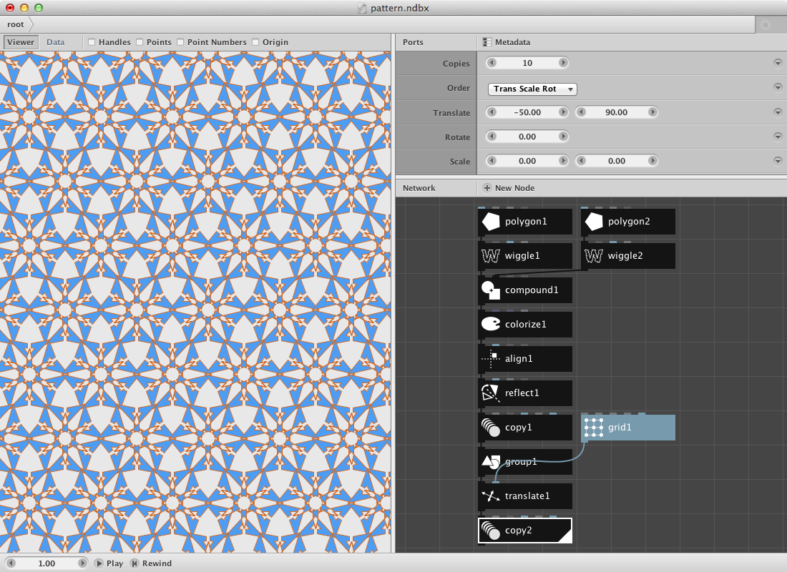
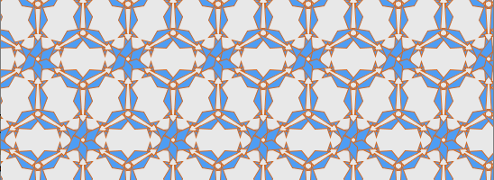
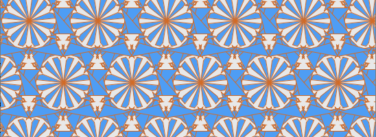
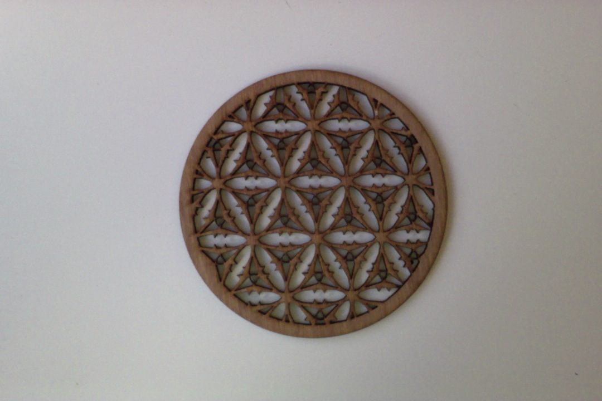
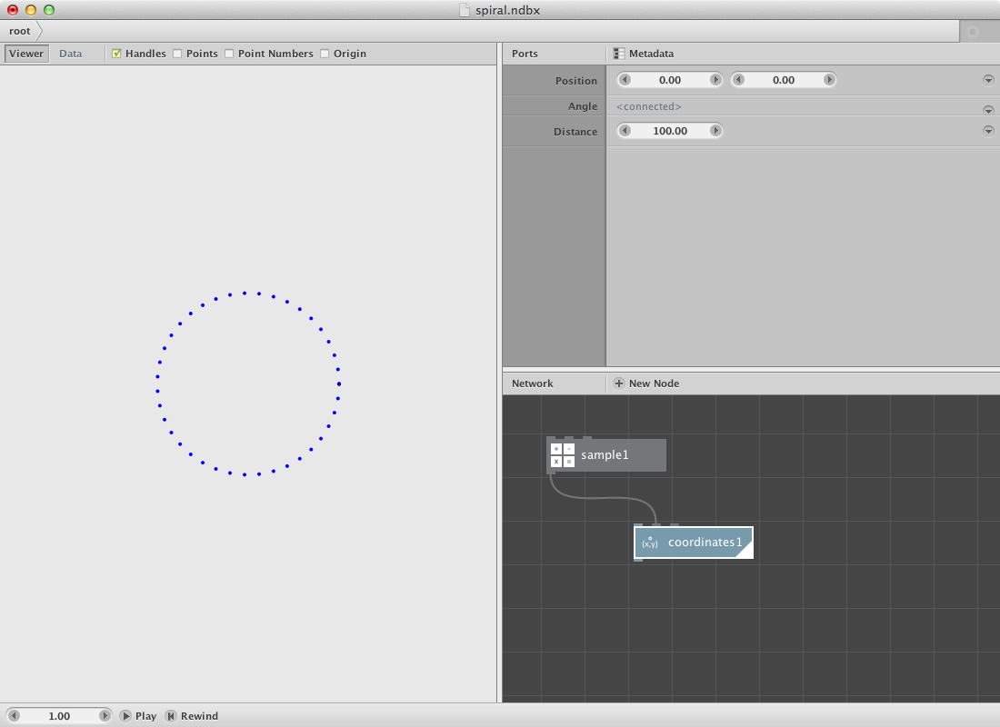
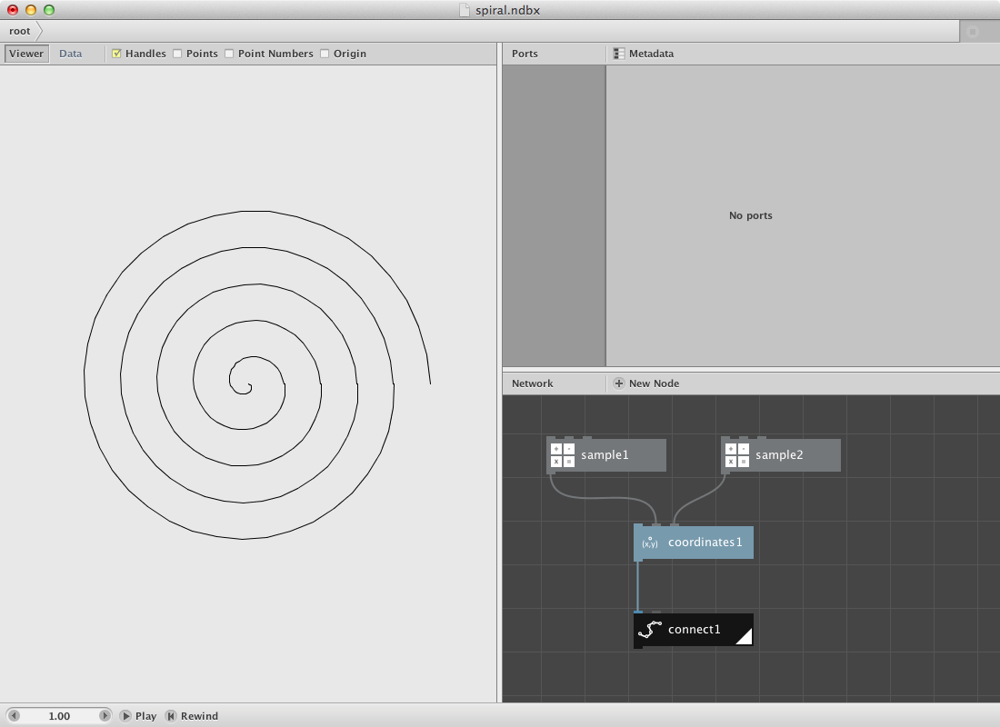
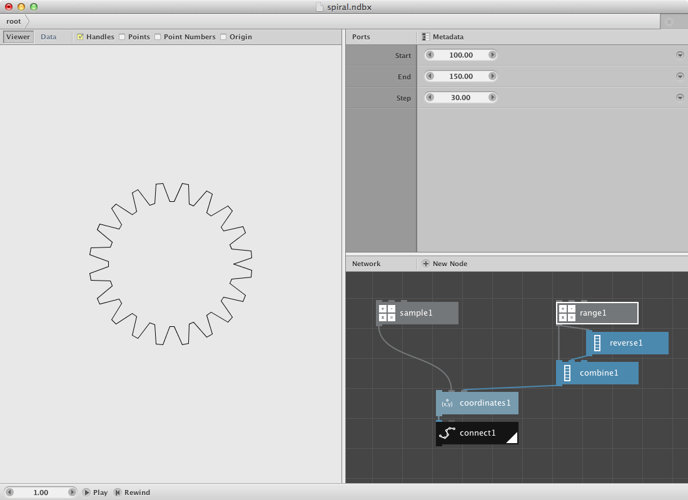

Spirograph Example
-------------------

Let's make a drawing based on the [Spirograph](http://en.wikipedia.org/wiki/Spirograph) principle. 

In short: we will **create a shape** and **copy it** a few times on top of each other with a difference in rotation.

Create a [freehand node](/node/reference/corevector/freehand.html) and draw a small line in order to have a reference for the rest of the procedure. You can **draw by clicking and dragging the mouse** in the viewer pane.

Create a [reflect node](/node/reference/corevector/reflect.html) node and send the output of freehand1 to it. Watch out: there are two reflect nodes, we need the one with a black icon.

* Change the **Angle** parameter to **90.00**. You should see the change in location of the reflected shape.
* Change the **X** parameter to **0.0**. Dito.

Create a [copy node](/node/reference/corevector/copy.html) and send the output of reflect1 to it.

* Change the **Copies** parameter to **10**.
* Change the **Rotate** parameter to **36.0**. The calculation of the rotation angle is based on the equation 360.0 / number of copies.

Render copy1 and click once on freehand1. Start drawing anything and see the spirograph appear. **Not pleased with the result?** You can **start over** and empty the path by selecting all numbers in the path parameter then press backspace and the return key.

**Try out:**

* Different settings for the parameters in copy1 to create more or less complex spirograph drawings.
* Insert a [colorize node](/node/reference/corevector/colorize.html) node between the freehand1 and reflect1 to experiment with colors.  
* Copy the four nodes, make a few variations and group them by sending all of them to a [combine node](/node/reference/list/combine.html).

A pattern example.
-------------------

Creating patterns is fairly easy in NodeBox 3.

Lets create an example:

Create two [polygon nodes](/node/reference/corevector/polygon.html).

* Set **Radius** for both of them to **20.00**.
* Set **Sides** to respectively **5** and **3** creating a pentagon and a triangle.
* Toggle on the **Align** parameter for both polygons.

The idea is to create a pattern which can be easily changed by using a seed parameter.

Create two [wiggle nodes](/node/reference/corevector/wiggle.html) and connect polygon1 to wiggle1 and polygon2 to wiggle2.

* Set **Offset** to **30** for the wiggle node handling the pentagon.
* Set **Offset** to **10** for the other one.
* Set **Seed** respectively **0** and **1**

We will generated a new shape based on the two shapes by using a binary opereration.

Create a [compound node](/node/reference/corevector/compound.html) and send wiggle1 to shape1 input and wiggle2 to shape2 input.

* Set **Function** to **Difference**.

A key node for building networks that create patterns is the [align node](/node/reference/corevector/align.html). It allows you to change the centerpoint of a geometry. The base for these operations on the vertical and horizontal axes is the origin which you can toggle on/off in the viewer pane. 

Create one and send compound1 to it.

* Set **HAlign** to **Left**.
* Set **VAlign** to **Bottom**.

Now create a (black) [reflect node](/node/reference/corevector/reflect.html) to make a reflection of the shape.

* Set **Angle** to **90**
* Turn on the **Keep Original** option

Create a [copy node](/node/reference/corevector/copy.html) to create a few copies. Connect reflect1 to it.

* Set **Copies** to **6**.
* Set **Rotate** to **60.00**.

The result should look like this:

Add a [colorize node](/node/reference/corevector/colorize.html) to give the shape a color.

Now we will create a [grid node](/node/reference/corevector/grid.html) to multiply the pattern on a horizontal axe. 

* Set **Rows** to **1**.
* Set **Columns** to **10**.

Now add a [translate node](/node/reference/corevector/translate.html) to the network and send the pattern (copy1) to the shape port and grid1 to the (blue) translate port.

Finally add an other copy node and send translate1 to it.

* Set **Copies** to **10**
* Set **Translate** to **-50** and **90**

Rendering the copy2 node should return this result:

**Try out:**

* Change the **Seed** parameter in one or both of the wiggle nodes to change the pattern:

One of the seeds send to a compound node (together with an ellipse) and cut out by using a CNC-cutter:

A shape example.
-------------------

Nodebox contains a few nodes which enable users to create a new shape. An interesting one is the [coordinates node](/node/reference/math/coordinates.html) that can create a set of points based on an angle and a distance from a point. Let's see what we can do with it.

Create a [sample node](/node/reference/math/sample.html) and 

* Set **Amount** to **40**
* Set **End** to **360** (since there are 360 degrees in a circle)

Create a coordinates node and send the sample1 node to the angle port. Leave the distance parameter at his default state of 100. You should get a result like this:

For the moment all points are at an even distance of the orgin point. We will change this by using another sample node. Create one and 

* Set **Amount** to **200**
* Set **End** to **200.0**

Send it to the distance port of the coordinates node. The coordinates node returns a list of points, to create an actual path send it to a [connect node](/node/reference/corevector/connect.html). Turn the **closed** parameter of so it does not connect the first point with the last one. This is your result:

Other shape can be created by using an other set of numbers for the distance and/or angle parameter.

Create a [range node](/node/reference/math/range.html) and

* Set **Start** to **50.0**
* Set **End** to **90.0**
* Set **Step** to **10.0**

This returns a list of these numbers: 50,60,70,80. Now create a [reverse node](/node/reference/list/reverse.html) to reverse the above list. Now send both lists to a [combine node](/node/reference/list/combine.html) resulting in a new list (50,60,70,80,80,70,60,50). Send the combine node to the distance port of the coordinates node. Render the connect node again and have a look at the result:

Play around with the parameters of the range node or the sample node. The following shape was created by changing the parameters.

sample node:

* Set **Amount** to **80.0**

range node:

* Set **Start** to **100.0**
* Set **End** to **150.0**
* Set **Step** to **30.0**

