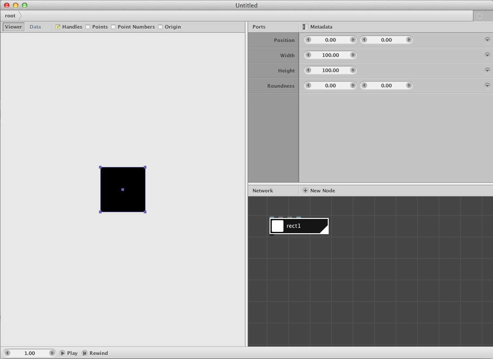
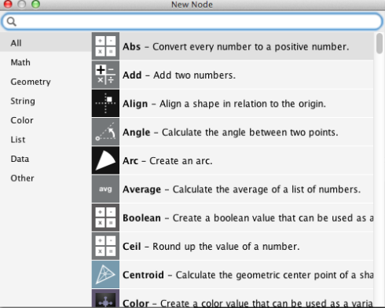
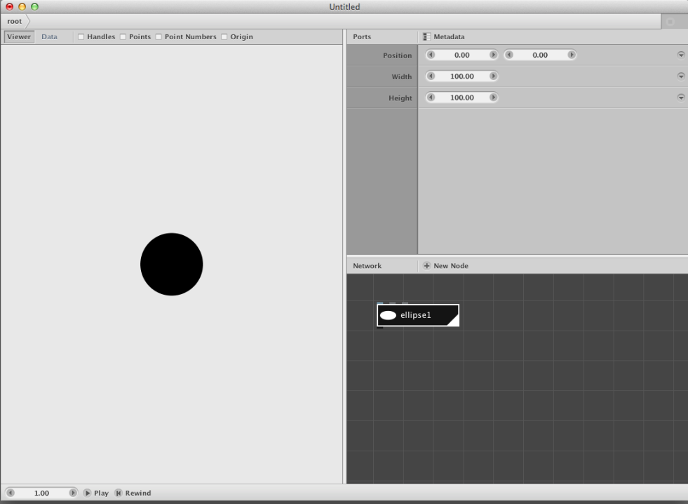
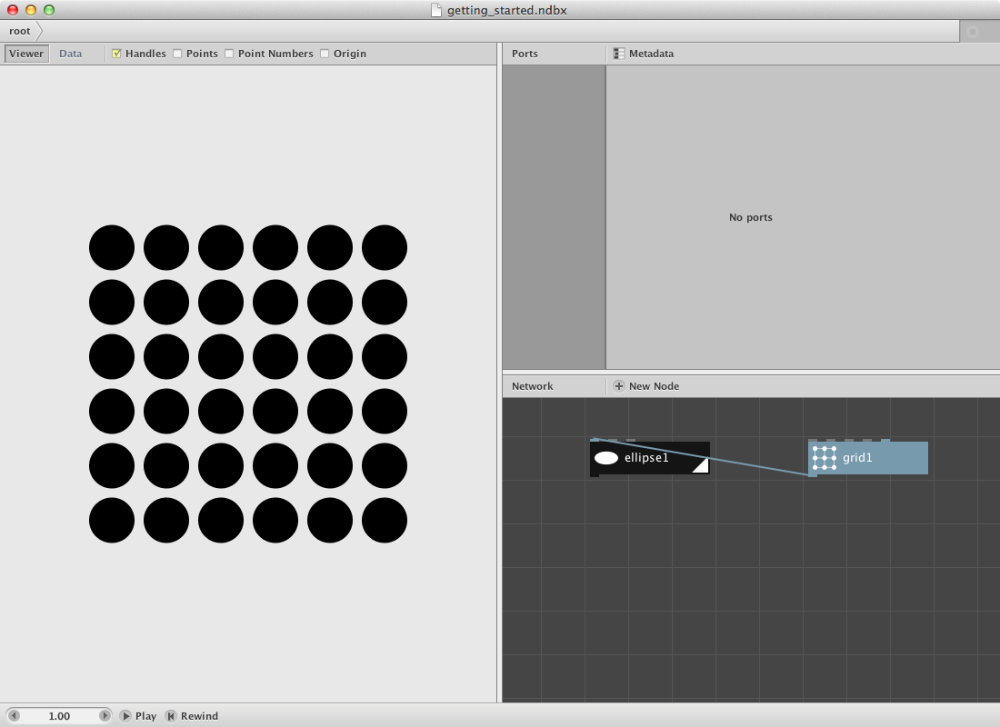
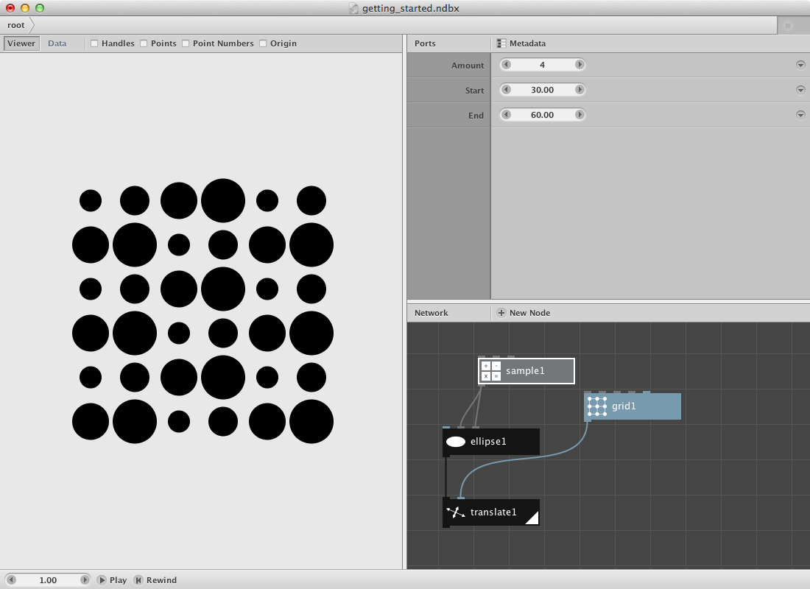

Welcome to NodeBox! In this tutorial we're going to learn the essentials for working with the program.

Downloading NodeBox
-------------------
If you haven't done this yet, you should [download](/download/) NodeBox first.

To install on Windows, double-click the installer and walk through the steps. On Mac OS X, drag the icon to your Applications folders (or anywhere you like).

Creating your first node
------------------------
Open the application. After a short loading time, NodeBox opens a new document window that looks like this:

NodeBox documents are composed of **networks of connected nodes**.

Remove the default [rect node](/node/reference/rect.html) by selecting it and by entering the backspace button.

Click the **New Node** button or double click anywhere in the network pane. This pops up the node selection window:

From this window, create an [ellipse node](/node/reference/ellipse.html). You can do this in three ways:

* Scroll through the (sorted) list until you find the Ellipse node, then double-click it.
* Click on the Geometry Tab and scroll through the list until you find the Ellipse node, then double-click it.
* Enter the first letters ("el") and press enter when the Ellipse node is selected. If there is more than one node use the arrow keys to select the node you want.

The NodeBox document window consists of three panes. These are (clockwise, from the top):

* **The Viewer Pane**, showing the composition you're working on.
* **The Parameters Pane**, allowing you to adjust the parameter values of a node.
* **The Network Pane**, showing all nodes and their connections.

NodeBox called the new ellipse node "ellipse1". That's because each node in NodeBox needs to have a unique name.

Let's change some parameters:

* Double-click the **Width** field (where it says "100"), type **50**, and press enter. The ellipse should now have a width of 50.
* Do the same thing for the **Height** field.

Your screen should look like this:

Everywhere you see a number, you can drag it to see what it does. If you make a mistake, you can undo.

Connecting nodes
----------------
The power of NodeBox comes from connecting nodes together. Nodes are connected using their ports. Each node has one output port and zero or more input ports. In this example, we're going to filter the output of the star node and snap all its points to a grid.

Click the **New Node** button again, and choose the [grid node](/node/reference/corevector/grid.html). Double-click it to place it in the network.

* Set **Rows** to **6**.
* Set **Columns** to **6**

You should see a grid in the viewer pane, but your ellipse is gone. We can connect one to the other by dragging from the output port of the grid1 node to the **position** input port of the ellipse1 node resulting in this output: 

Another possibility is to create a [translate node](/node/reference/corevector/translate.html) and send ellipse1 to the shape port and grid1 to translate port.

Rendered and Selected Node
--------------------------
NodeBox can only show the output of **one node at a time**. We see the output of this **rendered node** in the viewer pane. Currently, ellipse1 is the rendered node, indicated by the little white triangle at the right side of the node.

We can look at one node while working on the parameters of another node. We'll keep the ellipse1 node rendered while selecting the grid node (click on it once).

* Change the number of **Rows** and **Columns** and see what happens.

We've just updated the grid1 node, but we're still looking at the results of the ellipse1 node. This means the changed output of grid1 is passed on to serve as the input of ellipse1. This is the core idea behind NodeBox: *nodes passing (in this case) visual geometry or other information to other nodes*.

To recap:

* In the viewer, we look at the **rendered node**. In the network pane, the rendered node has a white triangle at the right bottom of the node. To change the rendered node, **double-click** a node.
* In the parameter pane, we look at the **selected node**. In the network pane, the selected node has a white stroke around it. To change the selected node, **click** a node once.

Variety
-------------
For the moment we draw the same ellipse on each point of the grid node. Let's create some variation in size and color. 

Suppose we want 3 different sizes for the ellipse and 5 different colors. 

Click the **New Node** button again, and choose the [sample node](/node/reference/math/sample.html). (You can also double-click in the network view which will open the Node Selection Dialog). Double-click it to place it in the network.

* Set **Amount** to **4**
* Set **Start** to **30.0**
* Set **End** to **60.0**

Double-click it and take a look at the viewer pane. You should see a list with 4 values (30.0, 40.0, 50.0 and 60.0) in it, visualized as elements below each other. Now connect the output to the **width** and **height** port of the ellipse node.

Leave all other nodes as before and double-click on the translate node to have a look at the result:

What happened is that the first ellipse gets the size of 30.0, the second a size of 40.0, third a size of 50.0, forth a size of 60.0. Since there are only 4 (size)options but a lot more points in the grid it will loop again over the same (size)list so the fifth ellipse gets a size of 30.0, the sixth a size of 40.0 and so on. 

Have a look at the [Nodebox Concepts page](/node/documentation/concepts/concepts.html) for more detailed information on this principle.

Now lets add color to the network.

Click the **New Node** button again, and choose the [colorize node](/node/reference/corevector/colorize.html). Double-click it to place it in the network and place it between the ellipse node and the translate node. You don't have to remove connections, just connect the ellipse node to the colorize node and the colorize node to the translate node. Nodebox will remove the previous connection.

Double click on the colorize node and click on the fill parameter: a color picker window will appear.

Choose a color and render the translate node. As a result all ellipses will have the same color.

Now lets create 5 different colors. 

Create a [hsb color node](/node/reference/color/hsb_color.html) and 

* Set **Saturation** to **200.0**
* Set **Brightness** to **200.0**

In order to create a number of colors we will change the value of **Hue** a number of times.

Create an other [sample node](/node/reference/math/sample.html) and 

* Set **Amount** to **5**
* Set **Start** to **50.0**
* Set **End** to **150.0**

Now connect this sample2 node to the hue port of the hsb color node. This will create 5 colors within a green - blue range. Finally connect the hsb color node to the fill port of the colorize node. Render the translate node again and have a look at the result:

Until now we worked with the same basic (ellipse) shape. Nodebox allows you to work with a variety in shapes. Lets replace the ellipse node with a [polygon node](/node/reference/corevector/polygon.html).

Create one and:

* Connect sample1 to the **Radius** port
* Create a [divide node](/node/reference/math/divide.html) and send sample1 to it. 
* Change the **Value2** to **10.0**
* Connect the output of this divide node to the **Sides** port of the polygon node.
* Change the **Width** and **Height** parameter of the grid node to **400.0** to make more space between the different elements.

You should get this result:

Saving and Exporting
--------------------
NodeBox saves documents in the .ndbx file format. These files can only be opened by NodeBox. If you want to use NodeBox compositions in other programs, **export** the document to PDF. You can use these PDF files in other graphic programs such as Adobe Photoshop or Illustrator. NodeBox preserves all vector information so your compositions won't be pixellated.

Export the document:

* Choose "Export..." from the File menu
* Navigate to the Desktop
* Export as "test.pdf" (without the quotes).
  (The first time might take a while). 
* Open this file by going to the desktop and double-clicking it. Zoom in to verify that all lines are still smooth.

NodeBox will export the rendered node. In our example, if we just wanted to export one polygon, we need to double-click the polygon1 node to make it rendered, then export again.

Next Steps
----------
Now that you've seen the basics, you can:

* [Explore Further](exploring.html): Build and explore interesting examples:  of basic nodes and how to use them together.
* [Animate](animation.html): See the basics of animation.
* [Learn the GUI](../using/gui.html): Discover all functionality of the NodeBox GUI.

