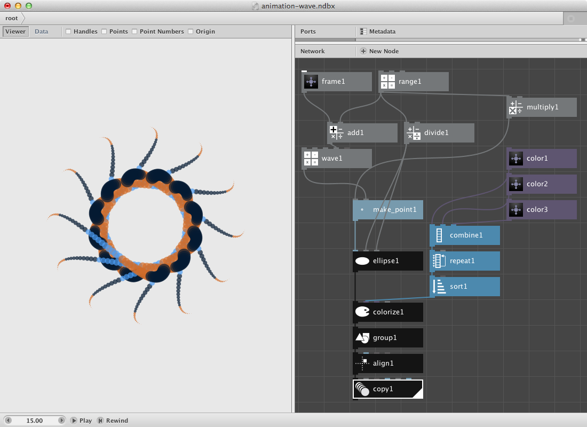

TODO
====

You should already have read the [tutorial on basic animation](/node/documentation/tutorial/animation.html). This pages goes into more detail and shows tricks and techniques.

Conceptually, NodeBox animation is very easy to understand. Every frame, NodeBox sets the value of FRAME to the current frame number. By referring to it over a frame node, you can create animations.

Let's start with a simple wave animation.

* Create a wave node. Set **Min** to **-100**, **Max** to **100.0** and **Speed** to **80.0**. We will address the frame a number of times.
* Create a frame node.
* Create a range node. Set **End** to **50.0**.
* Create an add node. Connect frame1 to **Value1** and range1 to **Value2**.
* Connect add1 to **Frame** of wave1.

We will divide and multiply the range for later usage. We will also create points based on the previous nodes.

* Create a divide node, connect range1 to **Value1** and set **Value2** to **2.0**. 
* Create a multiply node, connect range1 to **Value1** and set **Value2** to **3.0**.
* Create a make point node. Send wave1 to **Y** and multiply1 to **X**.

Now we will add some coloured shape to each of these points.

* Create an ellipse node. Connect make_point1 to **Position** and divide1 to **Width** and **Height**.
* Create three color nodes and pick colors.
* Create a combine node and send each of the color nodes to it.
* Create a repeat node and connect combine1 it. Set **Amount** to **10**. The idea is to have a possibility to change the number of times each color appears.
* Create a sort node and connect repeat1 to it. Set **Key** to **Hue**.
* Create a colorize node. Connect ellipse1 to **Shape** and sort1 to **Fill**.
* Render colorize1.

Test the animation by pressing the **Play** button in the animation bar.

<object classid="clsid:02BF25D5-8C17-4B23-BC80-D3488ABDDC6B" width="580"
        height="480" codebase="http://www.apple.com/qtactivex/qtplugin.cab">
        <param name="src" value="animation-snake.m4v" />
        <param name="autoplay" value="true" />
        <param name="controller" value="true" />
        <param name="loop" value="true" />
        <embed src="animation-snake.m4v" width="580" height="480" autoplay="true" 
        controller="true" loop="true" pluginspage="http://www.apple.com/quicktime/download/">
        </embed>
</object>

Notice that the alignment of the shape is at the right of the centerpoint. We will add a few nodes to changes this.

* Create a group node. Since colorize1 has multiple paths (for each ellipse one) we need to group it into 1 geometry object to be able to align it as a whole. Connect colorize1 to it.
* Create an align node. Connect group1 to **Shape**. Set **Halign** to **Right** and **Valign** to **Middle**.
* Create a copy node. Connect align1 to **Shape**. Set **Copies** to **12** and **Rotate** to **30**.
* Press play again.

<object classid="clsid:02BF25D5-8C17-4B23-BC80-D3488ABDDC6B" width="580"
        height="480" codebase="http://www.apple.com/qtactivex/qtplugin.cab">
        <param name="src" value="animation-wave.m4v" />
        <param name="autoplay" value="true" />
        <param name="controller" value="true" />
        <param name="loop" value="true" />
        <embed src="animation-wave.m4v" width="580" height="480" autoplay="true" 
        controller="true" loop="true" pluginspage="http://www.apple.com/quicktime/download/">
        </embed>
</object>

More Information
----------------
* Read the [using expressions](expressions.html) page for general information on expressions. This is also useful when creating animations.
* Read the [expression reference](/documentation/expressions/) for detailed information on every animation function.