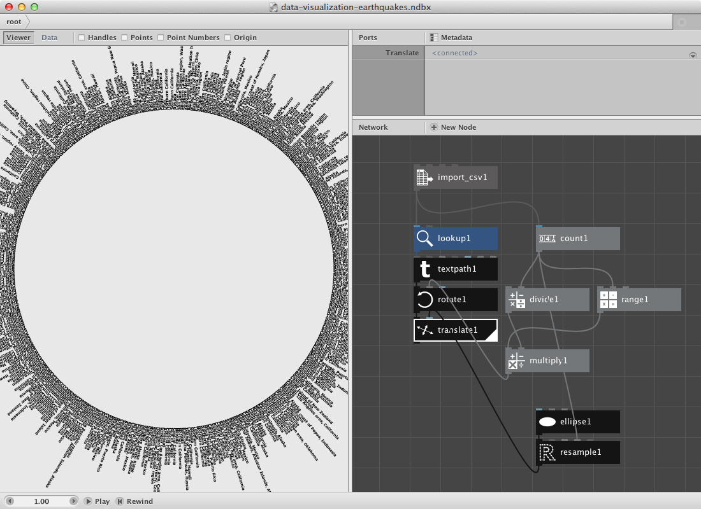
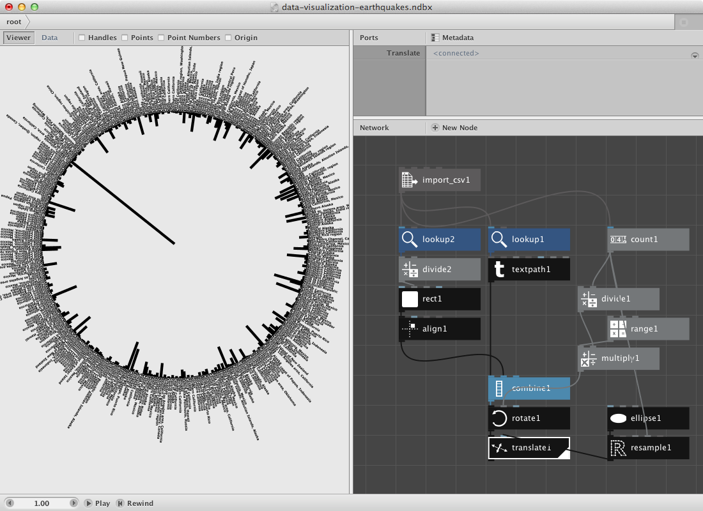
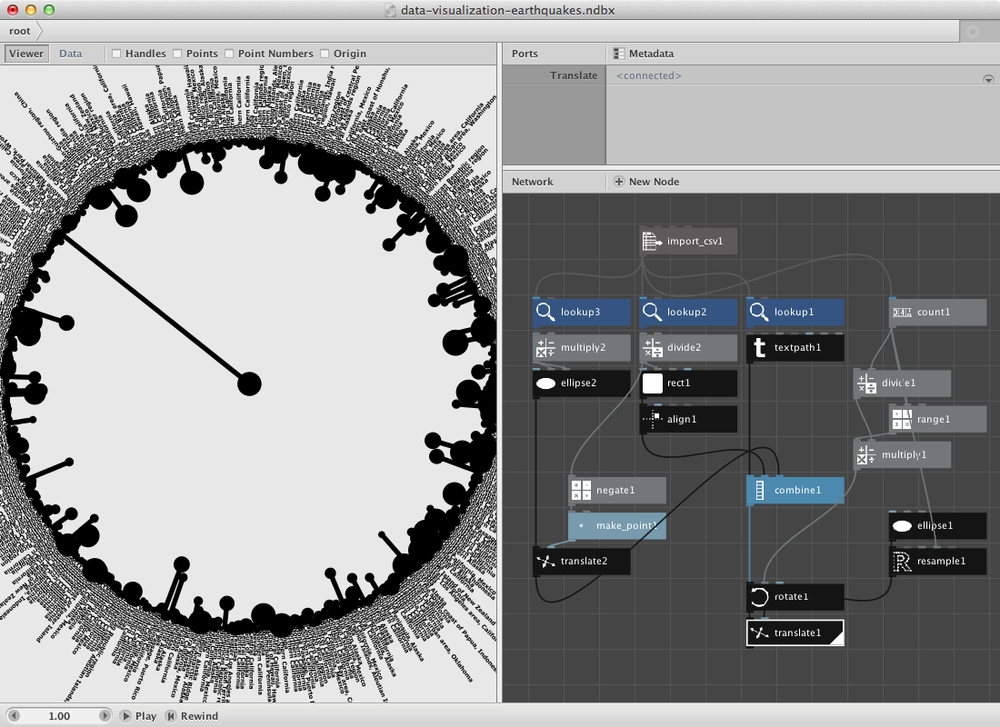
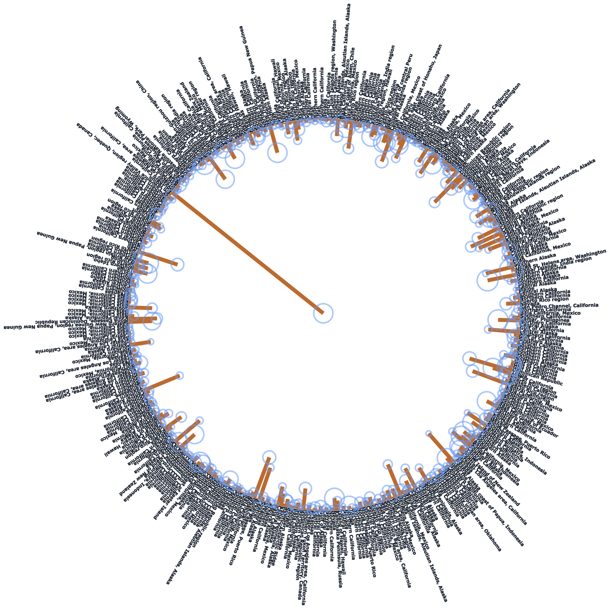
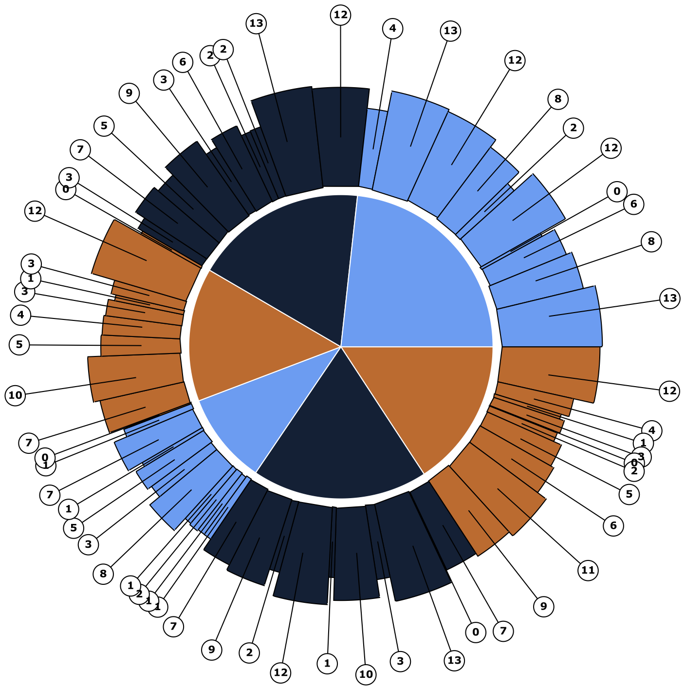
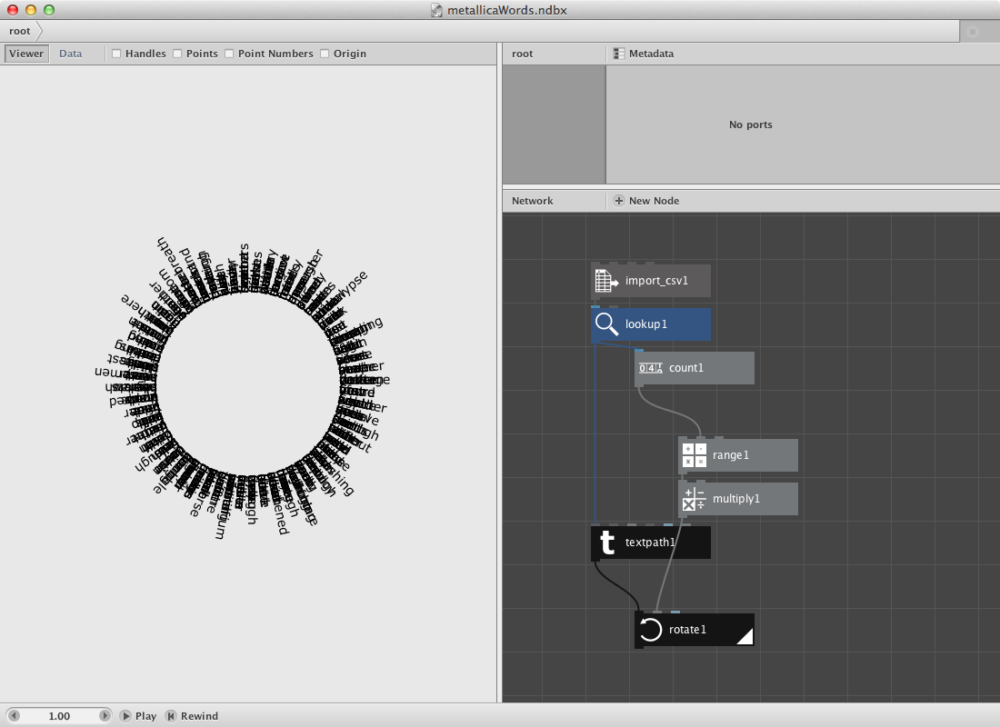
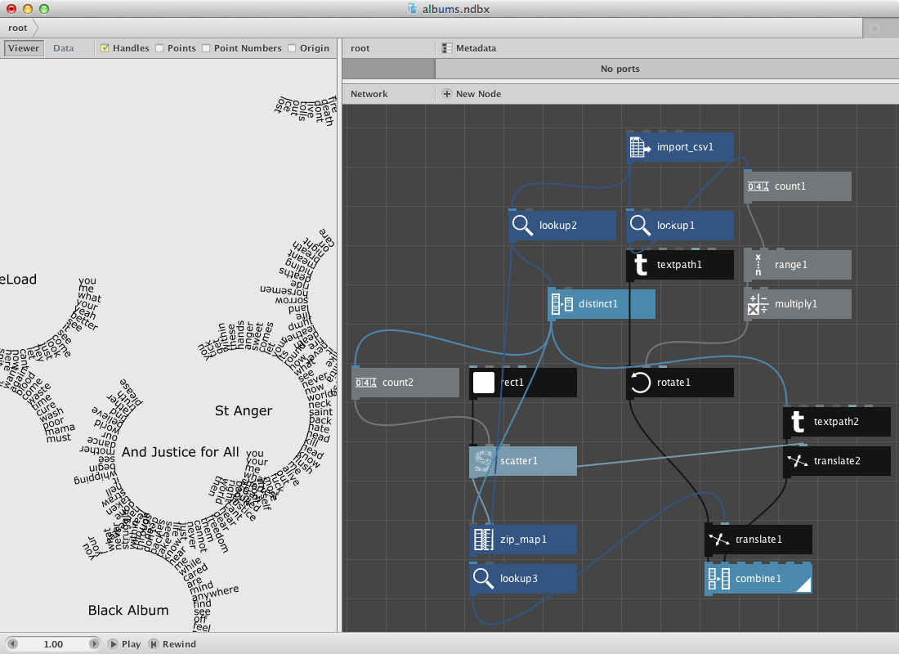
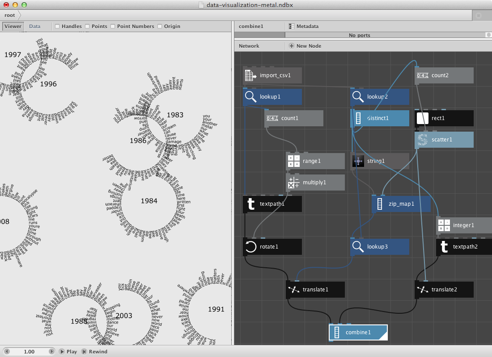
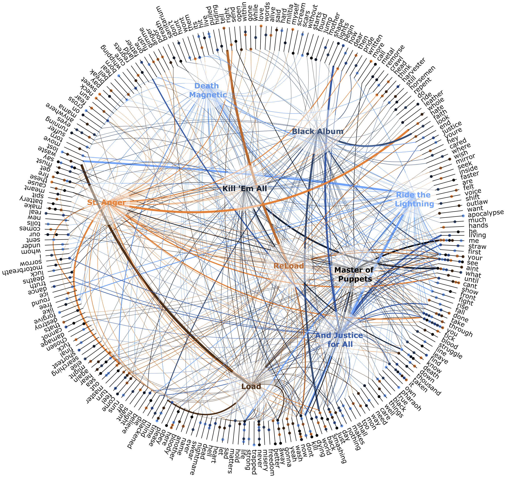

First things first.
-------------------
Before starting this section you should:

* [Learn about NodeBox concepts](../concepts/concepts.html).
* [Learn about random](../concepts/randomness.html): to learn how randomness works in NodeBox.
* [Learn about subnetworks](../concepts/subnetworks.html).

Random numbers.
------------------

Nodebox can be used to create data visuals. We will go over a few principles but let's first visualize a set of random numbers.

* Create a random numbers node. Set **Amount** to **15** and **End** to **200.0**.
* Create a rect node. Set **Height** to **20** and connect random numbers1 to **Width**.
* Create a count node and connect random numbers1 to it. We will use this to create a set of random colors and as an amount of points on a line node.
* Create a line node. Set **Point2** to **0.0** and **300.0**, returning a line going straight down.
* Create a resample node to make a list of points from it. Set **Method** to **amount**. Connect count1 to **Points** and connect line1 to **Shape**.
* Create a translate node and connect rect1 to *Shape** and resample1 to **Points**. Double click it to see the result.

Let's clean this up a bit with some extra nodes.

* Create a colorize node and put connect rect1 to it. We will give it a colour based on the weight of the random number as a color value.
* Create an align node. Set **Halign** to **Left** and **Valign** to **Middle**. Connect colorize1 to it and connect it to **Shape** of translate1.
* Create a hsb colour node. Set **Hue** to **150.0** and **Saturation** to **173.0**. Connect randomnumbers1 to **Brightness**.
* Connect hsb coulour1 to **Fill** of colorize1.
* Render translate1.
* Change **Seed** of random numbers1 to change the set of random numbers and thus the visualization.

The cost.
----------
Following data was found [online](http://www.informationisbeautiful.net/2010/debtris/) and stores a few macro economic figures and their explanation. We will do a similar example as above. You can have a look at the data or download a clean version of it [here](data-visualization-debtris.csv).

* Create an [import csv node](/node/reference/data/import_csv.html). Point to Debtris.csv in **File**. This reads in the complete csv file. Nodebox shows the file in the network pane.
* Create two lookup nodes. Set **Key** of lookup1 to **description** and of lookup2 to **pound**. These values refer to the index value of each column of the csv file. Connect import csv1 to both of them.
* Create a textpath node and connect lookup1 to it. Set **Align** to **Right**. Select a font and type.
* Create a rect node and connect lookup2 to **Width**. Set **Height** to **20.0**. The values of lookup2 are rather big so you might also want to add a divide node in between lookup2 and rect1.
* Create an align node and connect rect1 to it. Set position to **10.0** and **6.0**. This create a small shift upwards and to the right. Set **Halign** to **Left** and **Valign** to **Middle**.
* Create a combine node. Connect textpath1 to **List1** and align1 to **List2**

So far for the data itself. Now let's create a similar shape as before to map the data on.

* Create a count node and connect import_csv11 to it.
* Create a line node. Set **Point2** to **0.0** and **600.0**.
* Create a resample node to make a list of points from it. Set **Method** to **amount**. Connect count1 to **Points** and connect line1 to **Shape**.
* Create a translate node and connect combine1 to *Shape** and resample1 to **Points**. Double click it to see the result.

Try implementing color to the network.

Earthquakes.
------------------

They way data is represented can differ. In stead of using a line we will go over a procedure for an ellipse. Download this [earthquakes data file](data-visualization-earthquakes.csv).

* Create an import csv node and point to the csv file.
* Create a lookup node and set **Key** to **Region**. Connect import_csv1 to it.
* Create a textpath node. Set **Align** to **Left**. Connect lookup1 to **Text**.

The result so far is all information as text on top of each other. Next procedure will build the template to be used as points to translate all these different textpaths on.

* Create an ellipse node. Set **Width** and **Height** to **500.0**.
* Create a resample node. Set **Method** to **Amount**. Connect ellipse1 to **Shape**.
* Create a count node and connect import_csv1 to it. We will use this number to figure out what degree each segment needs and to create a range to multiply it to this segmentsize.
* Create a divide node. Set **Value1** to **360.0**. Connect count1 to **Value2**. Out comes the segment.
* Create a range node and send count1 to **End**.
* Create a multiply node. Connect range1 to **Value1** and divide1 to **Value2**.

Now we need a few transformation nodes to connect this data to the actual data. 

* Create a rotate node. Connect multiply1 to **Angle**. Connect textpath1 to **Shape**.
* Create a translate node. Connect rotate1 to **Shape** and resample1 to **Points**.
* Render translate1.

Have a look at the csv file and notice that it has a lot of columns. Let's add the depth and magnitude to it. 

* Create a lookup node and set **Key** to Depth.
* Create a divide node to enable scaling of the number. Connect lookup2 to **Value1**. 
* Create a rect node. Connect divide2 to **Width**. Set **Height** to **5.0**.
* Create an align node and connect rect1 to it. Set **HAlign** to **Right**.
* Finally create a combin node to store all shapes in them before the transformation nodes (rotate and translate). Then send this combined shape to rotate1.

You can change the second value of the divide node to make the rectangles longer.

* Create a lookup node and set **Key** to **Magnitude**. Connect import_csv1 to it.
* These are all rather small numbers so let's create a multiply node. Connect lookup3 to **Value1** and set **Value2** to **5.0**.
* Create an ellipse node and connect multiply2 to **Width** and **Height**.

Now we need the location of the rect we've been using to visualize the depth parameter. It can be retrieved from divide2 which we used to give rect1 a height.

* Create a [negate node](/node/reference/math/negate.html) and connect divide2 to it.
* Create a make point node and send negate1 to **X**.
* Create a translate node. Connect make_point1 to **Points** and ellipse2 to **Shape**.

Give it color by adding some color nodes and colorize nodes.

Random pie.
--------------

Nodebox allows you to create subnetworks. You should read the [subnetworks page](../concepts/subnetworks.html) if it doesn't ring a bell.

Below we will have a look at a similar principle as in the first example except that we will visualize the numbers in a piechart. The construction of it will use a subnetwork.

Let's start by creating a set of numbers. I want to be able to increase the amount of numbers in a seperate node.

* Create a number node and set **Value** to **11.0**.
* Create a random numbers node. Connect number1 to **Amount**.
* I want to turn this into a percentage so create a sum node. Connect random numbers1 to it.
* Create a divide node. Connect random numbers1 to **Value1** and sum1 to **Value2**.
* Create a multiply node and connect divide1 to it. Set **Value2** to **100.0**. You can rename it percentage by right-clicking the mouse and point to **Rename**.
* We want to construct a pie chart so a conversion to an other range might be handy. Create a [convert range node](/node/reference/math/convert_range.html). Set **Target End** to **360.0**.

Now for the pie. We will make a pie by using a [arc node](/node/reference/corevector/arc.html) which has a few interesting parameters. The idea is to create a network that takes an increasing slice of the random numbers list to make a sum of them. This will go to the *Start Angle** parameter of the arc node. The degrees of the arc will be retrieved from our convert_range node.

* Create a slice node. Connect convert_range1 to it.
* Create a sum node. Connect slice1 to it.
* Create an arc node. Connect sum2 to **Start_angle** and convert range1 to **Degrees**.
* Create a colorize node and send arc1 to **Shape**.
* Select slice1, sum2, arc1 and colorize1. Right-click and **Group into Network**. 
* Right click it again and rename it 'pie'.
* Right click it once more and **Edit Children**.
* Publish **Size** of slice1, name it 'Slicesize'. Publish **Fill** of colorize1, name it 'Fill'.

This is how the subnetwork and all its published port looks:

Go back to the root network and 

* Create a range node. Connect numbers1 to **End**.
* Connect range1 to *Slicesize** of pie.
* Create some colors and connect them to **Fill** of pie.

You can change the number of slices by changing numbers1.

Below is a pie in pie chart. This involves creating another subnet of the previous pie so it can be repeated for multiple sets of random numbers.

A zipmap example.
-----------------

The [zipmap node](/node/reference/list/zip_map.html) is an interesting node to have a separate example for it. Following datafile shows a selection of most used words on each Metallica-album. It was made using [Textalyzer](http://textalyser.net/). [Download it.](data-visualization-metalwords.csv)

* Create an import csv node and look for the csv file.
* Create a lookup node. Set **Key** to **Word** and connect import_csv1 to it.
* Create a textpath node and connect lookup1 to **text**. Select a font and set font size to **14**. Set **Align** to **Left** and the x value of **Position** to **100.0**.

Now we will place them on a circle.

* Create a count node and connect lookup1 to it.
* Create a range node and connect count1 to **End**.
* Create a multiply node. Connect range1 to it and set Value2 to **6**.
* Create a rotate node. Connect textpath1 to **Shape** and multiply1 to **Angle**.
* Render rotate1.

In the second section we will create a set of points based on the number of albums. Note that the datafile points to the year in which the album was released. We will than decide that word from one album all go to the same point and that for each word.

* Create a lookup node. Set **Key** to **Year**.
* Create a [distinct node](/node/reference/list/distinct.html). Connect lookup2 to it. Distinct removes all duplicates, what remains are 9 years each standing for one album.
* Create a count node. Connect distinct1 to it.

The idea is to generate a number of points. We will do this be using a rect node connected to a scatter node.

* Create a rect node. Set its dimensions to 500 * 500. 
* Create a scatter node. Connect rect1 to **Shape**. Connect count2 to **Amount**. We now have 9 points.
* Create a string node. Connect distinct1 to it.
* Create a zipmap node. Connect string1 to **Keys** and scatter1 to **Values**.
* Create a lookup node. Connect zip_map1 to **List** and lookup2 to **Key**.

The viewer pane will reveal only the same set of points but if you switch to data view you will see that each point has multiple points behind it (at the same location).

We will glue these two together.

* Create a translate node. Connect rotate1 to **Shape** and lookup3 to **Translate**.
* Create an integer node. Connect distinct1 to it.
* Create a textpath node. Connect integer1 to it. Select a type and a fontsize of **24.0**.
* Create a translate node. Connect textpath2 to **Shape** and scatter1 to **Translate**.
* Create a combine node. Connect translate1 to **list1** and translate2 to **List2**.
* Render combine1.

More zipmaps allow you to do more complex things:

