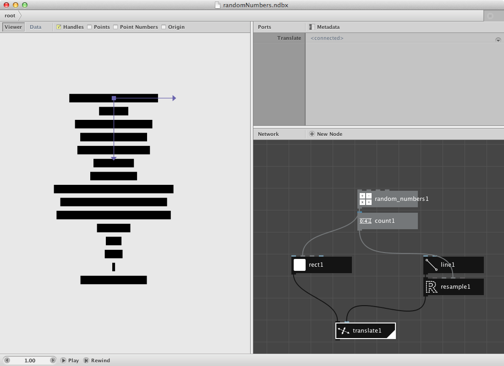
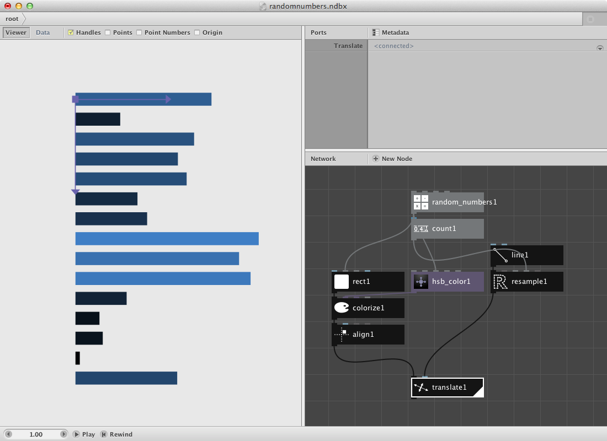
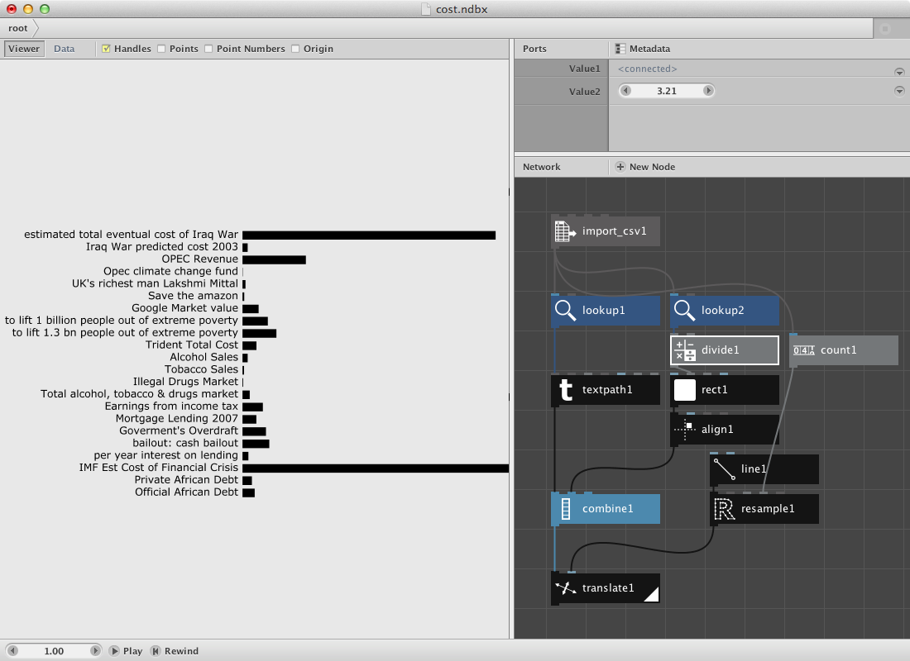

Random numbers.
------------------

Nodebox can be used to create data visuals. We will go over a few principles but let's first visualize a set of random numbers.

* Create a random numbers node. Set **Amount** to **15** and **End** to **200.0**.
* Create a rect node. Set **Height** to **20** and connect random numbers1 to **Width**.
* Create a count node and connect random numbers1 to it. We will use this to create a set of random colors and as an amount of points on a line node.
* Create a line node. Set **Point2** to **0.0** and **300.0**, returning a line going straight down.
* Create a resample node to make a list of points from it. Set **Method** to **amount**. Connect count1 to **Points** and connect line1 to **Shape**.
* Create a translate node and connect rect1 to *Shape** and resample1 to **Points**. Double click it to see the result.

Let's clean this up a bit with some extra nodes.

* Create a colorize node and put connect rect1 to it. We will give it a colour based on the weight of the random number as a color value.
* Create an align node. Set **Halign** to **Left** and **Valign** to **Middle**. Connect colorize1 to it and connect it to **Shape** of translate1.
* Create a hsb colour node. Set **Hue** to **150.0** and **Saturation** to **173.0**. Connect randomnumbers1 to **Brightness**.
* Connect hsb coulour1 to **Fill** of colorize1.
* Render translate1.
* Change **Seed** of random numbers1 to change the set of random numbers and thus the visualization.

The cost.
------------------

Following data was found online (needs website) and stores a few macro economic figures and their exaplanation. We will do a similar example as above. You can have a look at the data or download it [here](Debtris.csv).

* Create an [import csv node](/node/reference/data/import_csv.html). Point to Debtris.csv in **File**. This reads in the complete csv file. Nodebox shows the file in the network pane.
* Create two lookup nodes. Set **Key** of lookup1 to **description** and of lookup2 to **££**. These values refer to the index value of each column of the csv file. Connect import csv1 to both of them.
* Create a textpath node and connect lookup1 to it. Set **Align** to **Right**. Select a font and type.
* Create a rect node and connect lookup2 to **Width**. Set **Height** to **20.0**. The values of lookup2 are rather big so you might also want to add a divide node in between lookup2 and rect1.
* Create an align node and connect rect1 to it. Set position to **10.0** and **6.0**. This create a small shift upwards and to the right. Set **Halign** to **Left** and **Valign** to **Middle**.
* Create a combine node. Connect textpath1 to **List1** and align1 to **List2**

So far for the data itself. Now let's create a similar shape as before to map the data onto.

* Create a count node and connect import_csv11 to it.
* Create a line node. Set **Point2** to **0.0** and **600.0**.
* Create a resample node to make a list of points from it. Set **Method** to **amount**. Connect count1 to **Points** and connect line1 to **Shape**.
* Create a translate node and connect combine1 to *Shape** and resample1 to **Points**. Double click it to see the result.

Try implementing color to the network.

