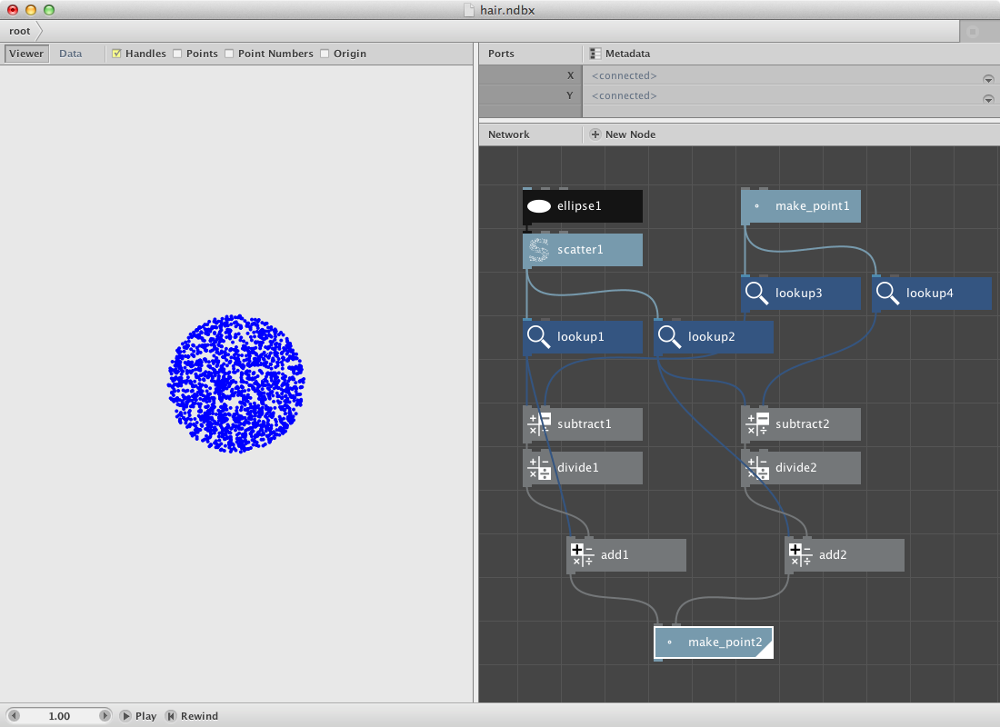

TODO
====
* Trigonometry: sine, cosine
* Absolute values
* Min/max

Math operations.
------------------

Nodebox allows a range of arithmetic operations suchs as multiply, divide, add, subtract. The nodes representing these functions can be used for instance to add numbers together but can also be used within more complex operations. In the following example we will have a look at a network which will create a set of hairs on a shape.

* Create an ellipse node and leave all parameters as default.
* Create a [scatter node](/node/reference/corevector/scatter.html) and set **Amount** to **1500**

The idea is to create a network which grows hair on all these points. In order to give it a location from which the hairs should grow away from we will implement a [make point node](/node/reference/math/make_point.html) with **X** set to **0.0** and **Y** also set to **0**. This node will allows us to change the direction of each hair later in the process.

Since the scatter node and the make point node contains point elements we will need a node to define the x and y values as seperate list. Therefore:

* Create 4 [lookup nodes](/node/reference/data/lookup.html). Set the key parameter for the first one to **x**, for the second one to **y**, the third one again **x** and finally the forth one again to **y**.
* Connect scatter1 to lookup1 and lookup2.
* Connect make point1 to lookup3 and lookup4.
* Render the lookup1 node and have a look at the result (a list of all the x values for each point in the scatter1).

Now we will subtract the x value of the make point1 node to each of the x values of the scatter1 node. We will do the same for the y values.

* Create two [subtract nodes](/node/reference/math/subtract.html).
* Connect lookup1 with **Value1** and lookup3 with **value2** for the first subtract node.
* Connect lookup2 with **Value1** and lookup4 with **value2** for the second one.

These new values will be used as the length of each hair. In order to be able to change that length 

* Add two [divide nodes](/node/reference/math/divide.html)
* Send subtract1 to the first one
* Send subtract2 to the second one.
* Change the **Value2** into **2.0** meaning we will take half of the original size.

Now we will add these values to the original x and y values of the scatter node and convert them into a set of new points.

* Add two [add nodes](/node/reference/math/add.html).
* Connect lookup1 with **Value1** and divide1 with **Value2**.
* Connect lookup2 with **Value1** and divide2 with **Value2**.
* Create a make point node.
* Connect add1 to **X**
* Connect add2 to **Y**

In order to create the hairs add a [line node](/node/reference/corevector/line.html)

* Connect scatter1 with **Point1**.
* Connect make point2 with **Point2**.

This should be the result:

Try out:

* Changing the original ellipse with an other shape like a rectangle or a textpath to obtain a hairy rect / text.
* Changing the x and y values of the make point1 node to have a difference in hair implant.

Math and paths.
------------------

Nodebox allows you to create a range of different paths and functions based on sine and cosine. The next example shows how to create a Lissajous path which is based on the parametric equations

    x = A*sin(at+δ)
    y = B*sin(bt+γ)

Lissajous curves can be seen on oscilloscopes and are the result of combining 2 trigonometric curves at right angles.

Create a [sample node](/node/reference/math/sample.html) to start with a set of numbers.

* Set **Amount** to **1000**.
* Set **End** to **15.00**.

Create two [multiply nodes](/node/reference/math/multiply.html) and send the sample node to each one of them.

* Set **Value2** to **10.84** for the first one.
* Set **Value2** to **10.00** for the second one.

Create two [sin nodes](/node/reference/math/sin.html) and send the multiply nodes respectively to the first one and the second one.

Create two more multiply nodes and send the sin nodes to them. These two multiply nodes will handle the width and height of the Lissajous path. You can rename them by using right click and select the rename option.

Create a [make point node](/node/reference/math/make_point.html).

* Send the first multiply node to the x port.
* Send the second one to the y port.

Create a [connect node](/node/reference/corevector/connect.html) and send the make point node to it. Finnally create a [colorize node](/node/reference/corevector/colorize.html) to give the path a fill and stroke color.

